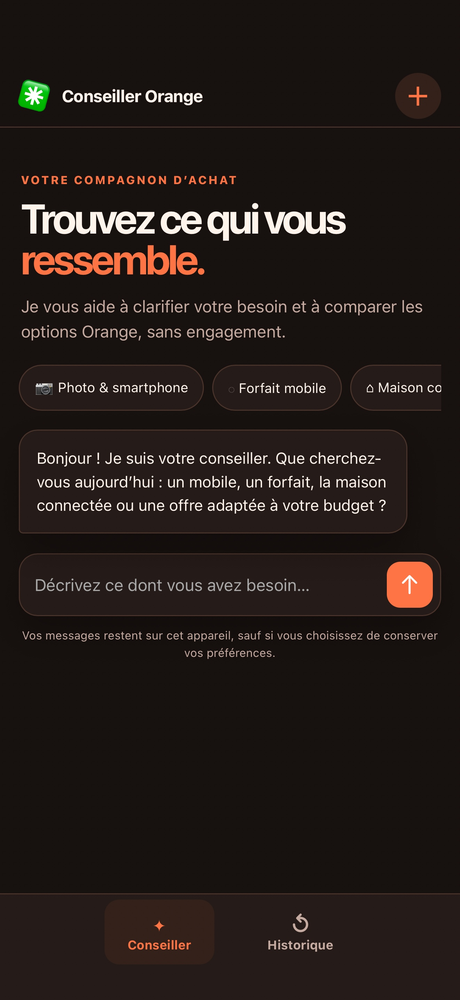
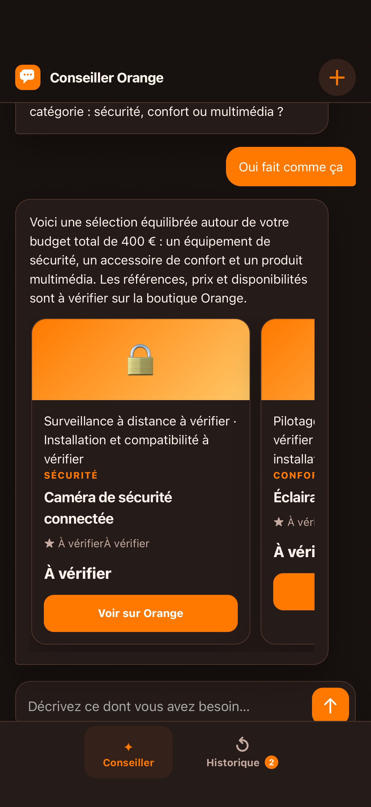
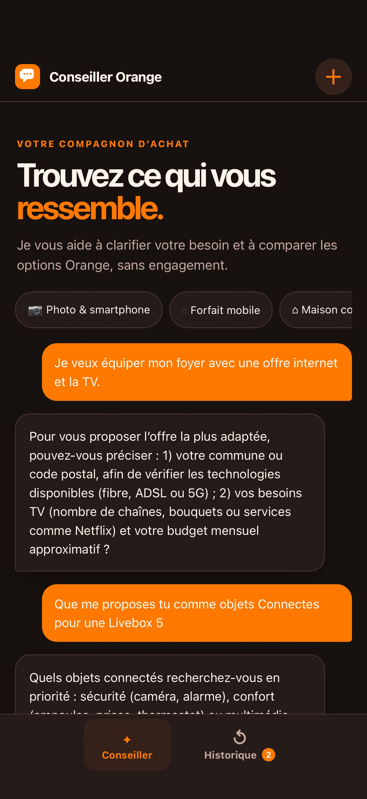

# Conseiller Orange

Un chatbot brandé Orange aide les clients à choisir des produits, forfaits et offres pertinents, puis les dirige vers l’achat en ligne.

## Ce que cette app demande

- `llm.ask`

## Ce qu’elle peut contacter

Rien : cette app ne sort pas du téléphone.

## Service nécessaire

Cette app appelle un service qui **n’est pas fourni avec elle** :

- `com.doungdoung/orange-marketplace`

Sans ce service déclaré sur l’appareil, l’app s’installe et s’ouvre, mais
ce qui en dépend échoue. Elle le dit à l’écran.

## Ce que c’est

Une page HTML, une feuille de style, un script, exécutés localement sur le
téléphone. Pas de dépendance, pas d’outil de construction.

Publiée par Marc Beaudoin (@marcbeaudoin). Relue par personne d’autre.

Sous licence MIT — voir `LICENSE`.
