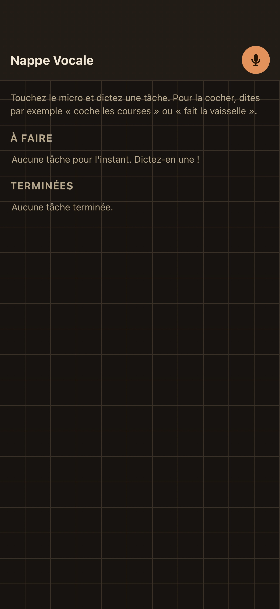

# Todolist

Une to-do liste que l'on remplit et coche entièrement à la voix.

## Ce que cette app demande

- `speech.listen`

## Ce qu’elle peut contacter

Rien : cette app ne sort pas du téléphone.

## Ce que c’est

Une page HTML, une feuille de style, un script, exécutés localement sur le
téléphone. Pas de dépendance, pas d’outil de construction.

Publiée par Marc Beaudoin (@marcbeaudoin). Relue par personne d’autre.

Sous licence MIT — voir `LICENSE`.
